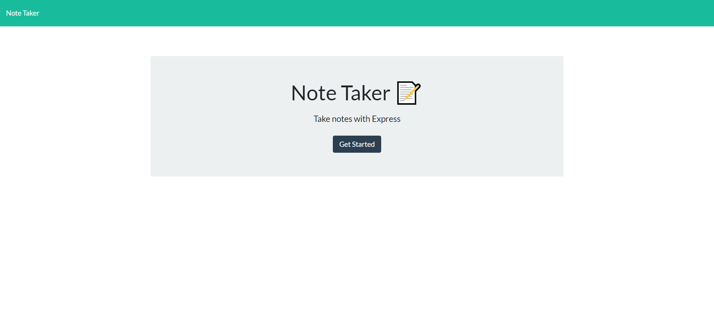
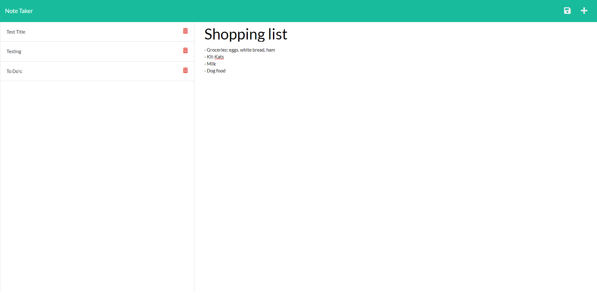

# Note Taker

## Description
Creating an application used to write and save notes, using Express.js. This application will save and retrieve note data from a JSON file. Users would be able to use this application to quickly write down any important notes and save and revisit them.

## Table of Contents
- [Installation](#installation)
- [Usage](#usage)
- [Demo](#demo)
- [License](#license)
- [Contribution](#contribution)
- [Tests](#tests)
- [Questions](#questions)

## Installation
- To install necessary dependencies, run the following commands:
npm i OR npm install OR npm install express@4.16.4

- Note that the herokuapp deployment would have the dependencies installed

## Usage
- Visit the deployed application to use.

Deployed Application - https://note-taker-23281995.herokuapp.com/

- Users would be directed to the home page, Click on the "Get Started" Button to be redirected to note taking page. From there, users would be able to click and write in the "Note Title" and "Note Text" areas. Once both areas are filled a save icon would appear in the top right, click on it to save your note. Once the page is refreshed, you would be able to see your saved notes on the left column. Users are able to click on the saved notes to pull up the context/text of the note. To write a new note click "+" icon on the top right.

## Demo

## License
- This project is licensed under MIT license.

## Contribution
- Please contact me for any contributions.

## Tests
- There are no tests at this very moment.

## Questions
- If you have any questions feel free to contact me directly at jeffreyp2328@gmail.com. You can also find more of my work at my Github: [jpjp2328](https://github.com/jpjp2328/).

